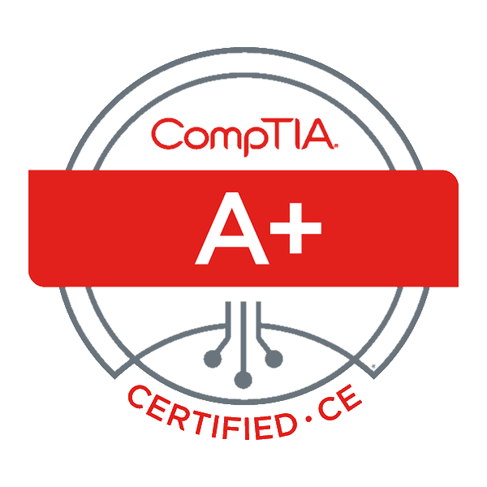
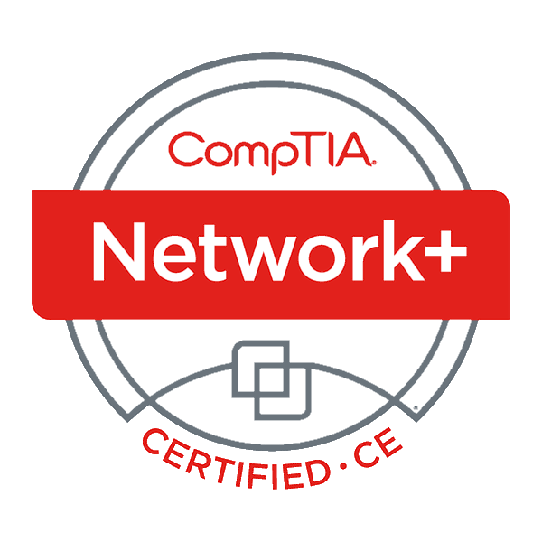

## Summary

Fourteen years of IT experience with an extensive knowledge about various technologies. Extremely personable and very comfortable with client interactions. Passionate about network security.

## Work Experience

#### Virtual IT, Idaho

   

      Network Engineer 
      8/2017 to Present
   

    

* Administer 100+ servers and 800+ Workstations for a wide variety of businesses

#### Howard Hughes Hospitality, Texas

   

      Manager of Information Technology 
      9/2012 to 11/2016
   

    

* Manage and maintain all servers, workstations and networking equipment for three local properties
* Harden servers, workstations and network equipment to a level of PCI DSS compliance
* Assist staff and guests in network related troubleshooting
* Complete internal and external audit requests for Sarbanes-Oxley compliance 
* HFTP Houston chapter member
* Assist with infrastructure design in new construction projects
* Design network topology, IP schema, network segmentations

#### The Arizona Grand Resort, Arizona

   

      Information Technology Technician 
      1/2008 to 8/2012
   

    

* Support staff and guests with issues related to network connectivity, software applications and hardware
* Setup and manage multiple servers, workstations, and network equipment for the Arizona Grand Resort, the Inn at Laguna Beach and the La Playa Hotel
* Setup networks, dedicated bandwidth and static IP addresses according to conference group needs
* Manage network defenses to insure proper PCI Compliance 
* Monitor LogRhythm reports for abnormal information

## Key Skills

|   |   |   |   |
| :---: | :---: | :---: | :---: |
| HyperV & ESXi Virtualization | Active Directory | Veeam, Backup Exec | 66/110 Telephony Blocks |
| High Availability Clusters | Microsoft Exchange | NEC & Asterisk VOIP Systems | HTML, PHP, JavaScript |
| Link Aggregation Switches  | Webroot, Sophos, Symantec | IIS, Apache, Tomcat, NGINX | Various PMS & POS |
| iSCSI LUNs/SAN Clusters | CMD/PS/Bash Scripting | SQL Syntax | Compliance Management |

## Education

   

      <b>Southwestern Vermont Career Development Center, Bennington Vermont</b> 
      2000 to 2004
   

    

* End User Support
* Computer Technology and Networking

   

      <b>University of Advancing Technology, Phoenix Arizona</b> 
      2005 to 2008
   

    

* Network Security and Administration

   

      <b>Western Governors University</b> 
      Currently Attending
   

    

* Bachelor of Science, Network Operations and Security

## Certifications

## Activities and Interests

#### SCUBA/Traveling
200+ logged dives in Hawaii, Honduras, Bahamas, Exuma Cays, Aruba and Bonaire

#### Motorcycling
Endorsed by the Motorcycle Safety Foundation (MSF)

